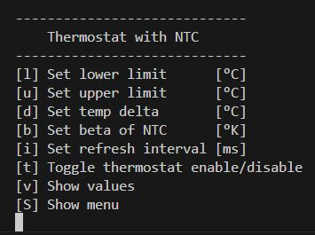
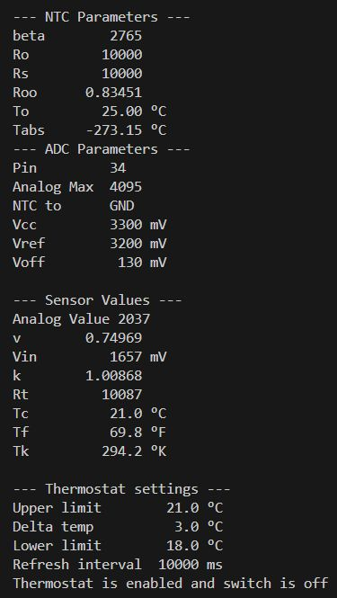

# Universal Thermostat for various Sensors

A thermostat is really nothing more than a switch that triggers appropriate 
actions at certain temperatures. The thermostat should not have to worry about
what kind of sensor is transmitting the temperature to it. Sensors such as the 
BME280/680, SHT31, DHT11/22 or even a simple NTC resistor measure different
values. Apart from the temperature, it can also be relative humidity, air 
pressure and air quality or a calculated value such as the dew point.

A thermostat must therefore only be able to query the temperature from the 
sensor and take action if the temperature is too low or too high. Because the 
actions can be different depending on the application, we declare them as 
callback functions, which the application program must implement.

The thermostat gains access to the sensor via a reference to a generic 
interface that is realized in C++ as a pure abstract class. This class defines 
the virtual methods that must be implemented by all sensor types.

```
class ISensor
{
  public: 
    virtual void setup()       = 0; // initialize the sensor 
    virtual void readSensor()  = 0; // read the sensor values into the sonsor data struct
    virtual float getCelsius() = 0; // returns the temperature in °C
    virtual void printData()   = 0; // print the data read from the sensor data struct
    virtual SensorData& getDataReference() = 0; // get a reference to the sensor data struct
};
```

So we declare a Thermostat class, which essentially looks like this:

```
using Callback = void (&)();

class Thermostat
{
  public:
    Thermostat(Isensor& sensor, Callback processData), 
               Callback onLowTemp, Callback onHighTemp : 
               _sensor(sensor), _processData(processData),
               _onLowTemp(onLowTemp), _onHighTemp(onHighTemp)
    {}

  private:
    Isensor&    _sensor;
    Callback    _processData;
    Callback    _onLowTemp;
    Callback    _onHighTemp; 
```

## NTC-Sensor
Maybe you also have some of these strange components in your tinkering box, 
which you removed from a defective battery pack or an old PC power supply. 
These are NTC resistors, i.e. resistors with a negative temperature 
coefficient. Their resistance therefore decreases with increasing temperature. 
They are suitable for temperature measurement or, as the title of this project 
says, for building a thermostat. 


## Some Formulas
If we connect an NTC resistor in series with another resistor whose value we 
know, we can measure the voltage at this voltage divider and calculate the 
unknown resistance value of the NTC from it. We can set up the voltage divider 
in two different ways, namely connect the NTC to ground or to Vcc. 
```
  ---+-- Vcc                            ---+--- Vcc
     |                                     |
    .-.                                   .-. 
    | | Rs                                |\| NTC
    '-'                                   '-' 
     |                                     | 
     +---> analog input                    +---> analog input
     |                                     |   
    .-.                                   .-.
    |/| NTC                               | | Rs
    '-'                                   '-'
     |                                     |
  ---+--- GND                           ---+--- GND
```
If we assume that the ADC (analog to digital converter) of our microcontroller 
delivers the value A<sub>val</sub> between 0 and A<sub>max</sub> (e.g. 0..1023), 
for input voltages from 0V to Vcc , the resistance of the NTC for the two cases 
is calculated as follows:

| NTC to GND |   | NTC to Vcc |
|:----------:|:-:|:----------:| 
| $R_t = R_s \cdot \frac{A_{val}} {A_{max} - A_{val}} \\~\\k = \frac{(A_{max} - A_{val})} {A_{val}}\\~\\R_t = R_s \cdot \frac{1}{k}$||$R_t = R_s \cdot \frac{A_{max} - A_{val}} {A_{val}} \\~\\k = \frac{(A_{max} - A_{val})} {A_{val}}\\~\\R_t = R_s \cdot k$|

Now we know the resistance value of the NTC as a function of the measured voltage. But how do we calculate the 
temperature from this? The ***Beta-Formula*** helps us ( [see NTC](http://www.resistorguide.com/ntc-thermistor/#Voltage-current_characteristic) ) :

$R_t = R_0 \cdot e^{\beta \cdot (\frac{1}{T} - \frac{1}{T_0})}$

$R_\infty = R_0 \cdot e^{\frac{-\beta}{T_0}}$

$R_t = R_\infty \cdot e^{\frac{\beta}{T}}$

$T = \frac{\beta} {\ln(\frac{R_t}{R_\infty})}$

In the Beta-Formula $\beta$ denotes the characteristic parameter of the NTC. 
It can be taken from the data sheet of the NTC but note that the beta values 
can vary considerably from resistor to resistor, even if they are the same type.
You can calculated $\beta$ from 2 resistance measurements at different temperatures:

$\beta = \frac{T_2 \cdot T_1}{T_2 - T_1} \cdot \ln(\frac{R_1}{R_2})$

Attention! In the formulas, the temperatures must be given in °Kelvin 

## Comparing the Analog to Digital Converters on different boards
### Arduino Uno
The ADC of the Arduino Uno maps the full input range 0..5V to the range 0..1023

### Wemos D1
The ADC of the ESP8266 has an input range of 0..1V which is mapped to 0..1023. 
But the Wemos D1 has an internal voltage divider 220k/100k with midpoint 
connected to the ADC and the 220k-endpoint connected to pin A0. Therefore the 
input voltage to convert at A0 must not exceed 3.2V to get the full range.

### ESP32 DevKit
The ADC of the ESP32 has selectable attenuations for different 
reference voltages. It maps the input voltage range from 0 to Vref to the 
range of 0..4095. Unfortunately the ADC also has a certain offset voltage 
which we have to consider 
( [see ADC ESP32](https://people.eecs.berkeley.edu/~boser/courses/49_sp_2019/N_gpio.html) ) :
```
Attenuation   ADC_0db   ADC_2_5db   ADC_6db    ADC_11db (default)
Vref          1100mv    1300mv      1800mv     3200mv
Voff          65mv      65mv        90mv       130mv
```
We can express the relationship between Vin and the analog output value Aval, 
taking Voff into account, with the following linear equation:
```
Vin = Aval * v + Voff  with  v = (Vref - Voff) / Amax
```
If we look at the series connection of Rs and Rt we see that 
$V_{in} = V_{cc} \cdot \frac{R_t}{R_s + R_t}$ 
if the NTC is connected to GND, or 
$V_{in} = V_{cc} \cdot \frac{R_s}{R_s + R_t}$ if Rt is connected to Vcc. 
So for the two cases we get for the resistance value of the 
NTC to GND: $R_t = R_s \cdot k$ or
NTC to Vcc: $R_t = \frac{R_s}{k}$ with
$k = \frac{V_{in}}{V_{cc} - V_{in}}$

So with this knowledge, we can connect the network Rs/Rt to any voltage Vcc as 
long as we keep the input voltage Vin smaller than the reference voltage Vref 
of the ADC.

## Design Steps
From the considerations made, we see that quite a lot of parameters have to be 
taken into a
NTC and one for the ADC. Further, we take into account that the attenuation 
only applies to the ESP32.

```
using ParamsNTC = struct paramsNtc { 
      uint16_t Rs; 
      uint16_t Ro; 
      uint16_t beta; };

using ParamsADC = struct parmsAdc{ 
      uint8_t pin; 
      bool ntcToGround; 
      uint16_t Amax; 
      adc_attenuation_t att; // only relevant for ESP32
      double Vcc; 
      double Vref; 
      double Voff; };
```

The NTC sensor only provides one result, namely the temperature. However, if 
we later want to connect another sensor to the thermostat, e.g. a BME280 or 
SHT31, which also measure humidity and even air pressure, it is better to save 
the measurement results in a SensorData data structure that we can adapt to 
the respective sensor.

In the case of the NTC sensor, we can also store the measured resistance 
value, the analog voltage, etc. in this structure and thus make it available 
to the end user.

```
using SensorData = struct sDat
{
    float    tCelsius;
    float    tFahrenheit;
    float    tKelvin;
    double   Roo;           // resistance for T --> oo
    double   k;             // k = Vin / (Vcc - Voff)
    double   v;             // v = (Vref - Voff) / analogMax
    double   vin;           // input voltage on ADC-pin
    double   Rt;            // calculated resistance at temperature T
    uint16_t analogValue;   // measured analog value Aval
    uint8_t  sensorPin;     // ADC input pin
    const double  To   = 25.0;    // nominal temperature
    const double  Tabs = -273.15; // absolute temperature 
};
```

Regardless of which type of sensor we use, we always want to initialize them 
in the same way and always query the measured values in the same way. This 
suggests the definition of an interface, which we can implement in C++ as a 
pure abstract class as described above.

Now we can design classes for the sensors, which inherit the interface and 
implement the required methods. The constructor of the `NTCsensor` class takes 
3 references as arguments, one to the parameters of the NTC sensor, the second 
to the parameters of the ADC and the third to a data struct where we store the 
measured results. The member variables are initialized, the pin mode of the 
analog input pin is set and the constant Roo is calculated. 

```
class NTCsensor : public Isensor
{
  public:
    NTCsensor(ParamsNTC& ntc, ParamsADC& adc, SensorData& sensorData) : 
              _ntc(ntc), _adc(adc), _sdata(sensorData)
      {
        pinMode(_adc.pin, INPUT);
        #ifdef ESP32
          analogSetAttenuation(_adc.att);
        #endif
        // calculate the resistance of the NTC for T --> oo
        _sData.Roo = _ntc.Ro * exp(-(double)_ntc.beta / (_sData.To - _sData.Tabs)); 
      }

    void setup();
    void readSensor();   // read the sensor and update the measured values
    float getCelsius();  // return the temperature in °C
    void printData();    // print the measured values
    void printParams();  // print the sensors parameters
    SensorData& getDataReference(); // get a reference to the sensor data struct

  private:
    ParamsNTC&  _ntc;
    ParamsADC&  _adc;
    SensorData& _sData;
}
```
Of course, we would like to be able to query the temperature in °C, °F and °K 
and also output the parameters of the NTC. The corresponding conversions are 
provided for this purpose. 

The temperature is measured periodically in the thermostats loop() method. The 
measurement interval and the two temperature limits are set with corresponding 
methods. All other details can be seen in the code. 

## User Interface
The program simply outputs the parameter settings and the measured 
values periodically. 

|Command Line Interface|Output|
|:--------------------:|:----:|
|||